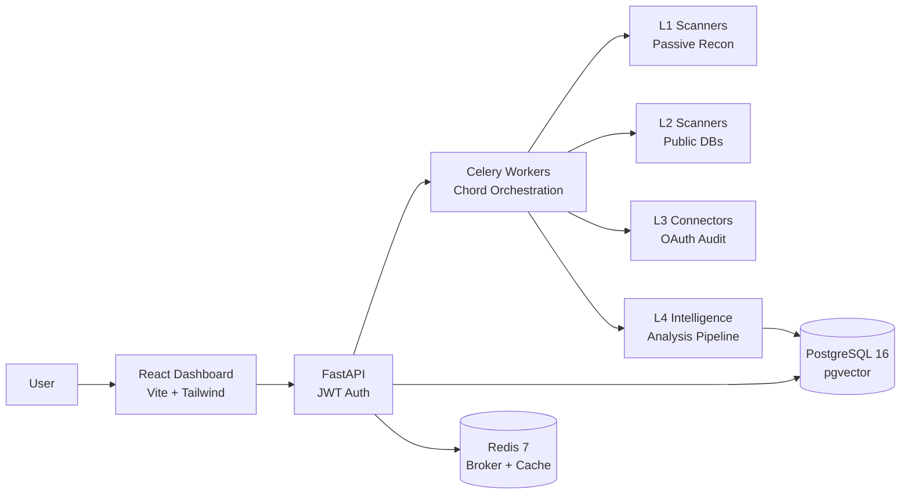

```
                                 ___
 __ __  _ __    ___   ___  ___  |__ \
 \ \/ /| '_ \  / _ \ / __|/ _ \    ) |
  >  < | |_) || (_) |\__ \  __/   / /
 /_/\_\| .__/  \___/ |___/\___|  |_|
       |_|    identity threat intelligence
```

[](https://python.org)
[](https://react.dev)
[](https://docker.com)
[](LICENSE)
[](#features)

**Enter an email. See what the internet knows. Fix it.**

xpose is an identity threat intelligence platform that bridges deep OSINT tools (SpiderFoot, Maltego) with consumer-grade UX (Aura, NordProtect). Every finding is an Identity IOC — with actionable remediation.

<!-- Add demo GIF here -->

---

## Features

| Layer | Category | Scanners | What it finds |
|:-----:|----------|----------|---------------|
| **L1** | Passive Recon | Holehe, Sherlock, HIBP, Gravatar, EmailRep, Epieos, FullContact, GitHub Deep, GHunt, Maigret, h8mail, Reverse Image | Account enumeration (120+ sites), breach history, social profiles, Google metadata, avatar matching |
| **L2** | Public Databases | DNS Deep, WHOIS, GeoIP, MaxMind, VirusTotal, Shodan, Intelligence X, Hunter.io, Dehashed, XposedOrNot | Domain security (SPF/DMARC/DKIM), IP geolocation, darkweb exposure, credential leaks, subdomain discovery |
| **L3** | Self-Audit | Google OAuth, Microsoft OAuth, Exodus Tracker, Browser Audit | Drive public files, Gmail forwarding rules, OAuth app permissions, app trackers |
| **L4** | Intelligence | IP Analyzer, Domain Analyzer, Username Correlator, Breach Correlator, Risk Assessor | Cross-reference all findings, exposure score (0-100), identity graph, prioritized remediation |
| **Identity** | Estimation | Genderize, Agify, Nationalize | Gender, age, nationality prediction from name with confidence scores |
| **Archive** | Historical | Wayback Machine CDX | Domain archive history, snapshot count, deleted profile recovery |
| **Gaming** | Digital Life | Steam, Xbox, PSN, Epic, Riot, Chess.com, Lichess | Gaming profiles, linked accounts, activity exposure |
| **Plans** | Monetization | Free / Consultant / Enterprise | Tiered access, scan quotas, layer restrictions, feature gating |
| **Admin** | Platform | User Management, Workspace Management | Superadmin panel: all users, workspaces, plan changes, activate/deactivate |

## Architecture



## Quick Start

```bash
git clone https://github.com/nabz0r/xposeTIP.git && cd xposeTIP
cp .env.example .env                          # configure API keys
docker compose up -d                          # start all 5 services
docker compose exec api python scripts/seed_modules.py
# Register at http://localhost:5173 → Add target → Scan
```

> Full setup guide with troubleshooting: [docs/INSTALL.md](docs/INSTALL.md)

## Documentation

| Document | Description |
|----------|-------------|
| [INSTALL.md](docs/INSTALL.md) | Full setup, environment variables, troubleshooting |
| [ARCHITECTURE.md](docs/ARCHITECTURE.md) | System design, DB schema, scan pipeline, queue flow |
| [SCANNERS.md](docs/SCANNERS.md) | All 25+ scanners and 43 scrapers with descriptions |
| [API.md](docs/API.md) | REST API reference (also available at `/docs` via Swagger) |
| [CONTRIBUTING.md](docs/CONTRIBUTING.md) | How to add a scanner, code style, PR guidelines |

## Roadmap

| Version | Sprint | Status |
|---------|--------|--------|
| v0.1.0 | Docker, Auth, Holehe, Celery, React dashboard | Done |
| v0.2.0 | HIBP, Sherlock, Score engine, Identity graph | Done |
| v0.3.0 | Gravatar, Social Enricher, GeoIP, Settings UI | Done |
| v0.4.0 | Dynamic API keys (Fernet), Location mapping | Done |
| v0.5.0 | 7 new scanners, Profile aggregation, SVG world map | Done |
| v0.6.0 | Source scoring, Premium scanners, SaaS connectors | Done |
| v0.7.0 | Intelligence engine, Google OAuth audit, Demo flow | Done |
| v0.8.0 | Digital fingerprint, 8-axis radar, evolution timeline | Done |
| v0.9.0 | Scraper engine, modular scrapers with editable regex | Done |
| v0.10.0 | Quality polish, dedup, profile name fix | Done |
| v0.11.0 | 15 new scrapers: identity, archive, social expansion | Done |
| v0.12.0 | IdentityCard, photo strip, profile aggregator fix | Done |
| v0.13.0 | Persona clustering, per-field confidence, PersonaCard | Done |
| v0.14.0 | Dual score (exposure + threat), score history, LifeTimeline | Done |
| v0.15.0 | Real-time log viewer, Redis ring buffer, structured logging | Done |
| v0.16.0 | Multi-workspace, workspace CRUD, member invites, Organization | Done |
| v0.17.0 | Connected accounts, Google/Microsoft OAuth audit | Done |
| v0.18.0 | 7 gaming scrapers, 6 social scrapers, import/export (43 total) | Done |
| v0.19.0 | Scraper UI: test runner, toggle, YAML export/import | Done |
| v0.20.0 | Plans (Free/Consultant/Enterprise), open registration, billing UI | Done |
| **v0.21.0** | **Admin panel, quick scan, invite flow fix** | **Done** |
| v0.22.0 | PDF reports, GHunt integration, WebSocket | Next |

> **Nexus 2026 — June 10-11, Luxembourg** &nbsp; Target: Grand Prize

## Tech Stack

`FastAPI` `SQLAlchemy 2.0` `Celery` `PostgreSQL 16` `Redis 7` `React 18` `Vite` `Tailwind CSS 4` `D3.js` `Recharts` `Docker Compose` `Fernet AES-256` `JWT` `OAuth 2.0` `RBAC` `Genderize` `Agify` `Nationalize` `Wayback Machine CDX`

## License

MIT License. See [LICENSE](LICENSE).

---

<p align="center">
Built in Luxembourg 🇱🇺 &nbsp;|&nbsp; GDPR compliant &nbsp;|&nbsp; MIT License<br/>
<sub>Your personal SOC for privacy.</sub>
</p>
