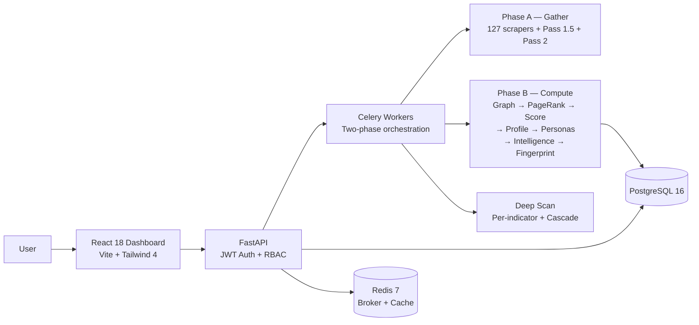

```
                                 ___
 __ __  _ __    ___   ___  ___  |__ \
 \ \/ /| '_ \  / _ \ / __|/ _ \    ) |
  >  < | |_) || (_) |\__ \  __/   / /
 /_/\_\| .__/  \___/ |___/\___|  |_|
       |_|    identity threat intelligence
```

[](https://python.org)
[](https://react.dev)
[](https://docker.com)
[](LICENSE)
[](#scraper-engine)
[](#changelog)
[](#changelog)

**Enter an email. See what the internet knows. Fix it.**

xpose is an identity threat intelligence platform that bridges deep OSINT tools (SpiderFoot, Maltego) with consumer-grade UX (Aura, NordProtect). One email in — identity graph, risk score, digital personas, and remediation plan out.

---

## How It Works

```
Email input
    │
    ▼
┌─────────── Phase A: GATHER ───────────┐
│ Cross-verify findings                  │
│ Pass 1.5: username expansion (72 scr.) │
│ Early profile (bootstrap primary_name) │
│ Pass 2: public exposure (GDELT, news)  │
└─────────────────────────────────────────┘
    │
    ▼
┌─────────── Phase B: COMPUTE ──────────┐
│ Identity graph → PageRank              │
│ Score (exposure + threat)              │
│ Profile → Personas → Intelligence      │
│ 9-axis fingerprint + pixel art avatar  │
└────────────────────────────────────────┘
    │
    ▼
Dashboard: graph, timeline, accounts,
    remediation, PDF export
```

## Features

### Scanning Layers

| Layer | What | How |
|:-----:|------|-----|
| **L1** | Passive Recon | 127 scrapers: account enumeration, breach history, social profiles, username expansion, phone/crypto enrichment, legal records (US/FR/UK) |
| **L2** | Public Databases | DNS deep (SPF/DMARC/DKIM/subdomains), WHOIS, GeoIP, certificate transparency, SaaS detection |
| **L3** | Self-Audit | Google/Microsoft OAuth app permissions, Drive public files, Gmail forwarding rules |
| **L4** | Intelligence | Identity graph, PageRank confidence, dual scoring, persona clustering, behavioral profiling, risk assessment |

### Intelligence Engine

- **Two-phase pipeline** — Phase A gathers all findings (Pass 1 + 1.5 + 2), Phase B computes graph/score/personas on the complete dataset
- **Identity graph** — nodes (email, usernames, platforms, domains, IPs, locations) linked by typed edges, rebuilt from all findings every scan
- **PageRank confidence** — confidence propagates through the graph (damping=0.85), cross-verified findings get boosted
- **Dual scoring** — exposure (digital footprint size) + threat (breach severity, credential leaks) with ratio-based thresholds
- **Persona clustering** — groups usernames by platform overlap, name similarity, and cross-verification
- **9-axis digital fingerprint** — accounts, platforms, username_reuse, breaches, geo_spread, data_leaked, email_age, security, public_exposure
- **Generative pixel art** — deterministic 32x32 CryptoPunk-style avatar from graph eigenvalues (5.4B unique combinations, zero GPU)
- **Deep Scan** — operator-triggered per-indicator scan across all matching scrapers, with cascade (discovered cross-type indicators are chain-scanned)
- **Web Discovery (Phase C)** — fingerprint-driven Google dorking + 6 content extractors — explores the open web beyond the 124 fixed scrapers
- **Phone Intelligence** — automatic phone number extraction from breach data + carrier/line type enrichment
- **Crypto Wallet Tracking** — BTC/ETH wallet identification with balance, transaction history, and scam flag detection via ChainAbuse

### Scraper Engine

124 data-driven scrapers, all configurable via UI (URL template, extraction rules, rate limits):

| Category | Count | Examples |
|----------|-------|---------|
| Social profiles | 35 | Reddit, GitHub, Steam, Medium, Mastodon, Twitch, Telegram, Bluesky, Threads, TikTok |
| Social search | 18 | StackOverflow, LinkedIn, Pinterest, Behance, Dribbble, ProductHunt, Kaggle |
| People search | 4 | Google People, Snapchat, Crunchbase, WebMii |
| Breach / leak | 5 | HIBP, LeakCheck, XposedOrNot, IntelX, LeakLookup |
| Identity estimation | 3 | Genderize, Agify, Nationalize |
| Metadata | 12 | DNS DMARC, crt.sh, Disposable Email, Mailcheck, Disify, HackerTarget |
| Code leak | 3 | GitHub Code Search, GitHub Gists, GitHub Scraper |
| Archive | 6 | Wayback Machine (domain, profile, LinkedIn, Twitter, Instagram, Facebook) |
| Gaming | 9 | Steam, Roblox, Chess.com, Lichess, RuneScape, MyAnimeList, Anilist, Speedrun, CodeWars |
| Music / media | 5 | SoundCloud, Mixcloud, Last.fm, Bandcamp, Discogs |

Every scraper has:
- **429 retry** — exponential backoff (3 attempts, max 10s)
- **Per-scraper module attribution** — findings tagged with real scraper name, not generic "scraper_engine"
- **Extraction rules** — JSON-configured field extraction (json_key, regex, css_selector)
- **Health monitoring** — response time + success rate tracked per scraper

### Public Exposure (Pass 2)

Name-based enrichment after profile aggregation:
- **GDELT** — global media mentions via full-text search
- **Google News RSS** — multi-language news articles (en + detected language)
- **OpenSanctions** — PEP, sanctions, watchlist matching
- **OpenCorporates** — corporate officer records
- **Interpol Red Notices** — wanted persons matching

### Reports & Export

- **PDF Identity Report** — dark-themed, tiered by plan (ReportLab)
- **CSV export** — all findings exportable
- **Executive summary** — auto-generated narrative per target
- **Remediation plan** — prioritized actions based on finding severity

## Architecture



**~38K lines** — 26K Python, 12K React/JSX. 113 Python modules, 26 frontend pages/tabs.

## Quick Start

```bash
git clone https://github.com/nabz0r/xposeTIP.git && cd xposeTIP
cp .env.example .env                          # configure API keys
docker compose up -d                          # start all 5 services
docker compose exec api alembic upgrade head  # run migrations
docker compose exec api python scripts/seed_modules.py
docker compose exec api python scripts/seed_scrapers.py
docker compose exec api python scripts/seed_blacklist.py
docker compose exec api python scripts/sync_avatars.py
# → http://localhost:5173 — Register → Add target → Scan
```

First registered user = **superadmin** with **Enterprise** plan.

## Plans

| Plan | Price | Scans/mo | Seats | Key Features |
|------|-------|----------|-------|--------------|
| Free | €0 | 25 | 1 | Basic exposure scan, single identifier, fingerprint preview |
| Starter | €49/mo | 250 | 1 | Full 127-source pipeline, identity graph + personas, PDF reports |
| Team | €299/mo | 2 000 | 5 | API access (SIEM/SOAR), multi-workspace, shared targets |
| Enterprise | From €2 500/mo | Custom | Unlimited | Multi-tenant + SSO, audit log + SLA, custom scrapers, managed APIs |

Custom identity intelligence reports (due diligence, compliance, threat attribution) are available as a separate service. [Contact us](mailto:contact@redbird.co.com).

## Principles

### Ethical OSINT
- **Consent-first**: scan yourself or with DPA authorization
- **Transparency**: every finding shows its source, every score explains its reasoning
- **Purpose limitation**: expose to protect, not to exploit

### Green Intelligence
- Maximum insight per watt — Amiga 500 philosophy
- Data-driven scrapers (JSON config, not code per source)
- Single PostgreSQL, no distributed clusters
- Pixel art avatars: 5.4B combos, zero GPU, zero API call
- Every architecture decision: "is this the lightest way?"

## Changelog

114 sprints delivered. Key milestones:

| Version | Highlights |
|---------|-----------|
| v1.1.16 | **Findings tab preset filter chips** — closes S119 navigation loop: deep-link from Risk Signals "View all" to a filtered Findings tab. New shared lib/findingFilters.js classifier |
| v1.1.15 | **Risk Signals UI block** on Overview tab — surface phone/crypto/legal findings in a 3-column self-hiding block (deferred S108 plan) |
| v1.1.14 | **EU legal scrapers** — BODACC (FR procédures collectives) + UK Gazette (London/Edinburgh/Belfast). Both no-auth, person-centric |
| v1.1.13 | **Courtlistener** US federal court scraper (MVP, collection only) — RECAP archive via REST API v4, token auth, legal_record indicator_type |
| v1.1.12 | **4-tier SaaS alignment** — consultant→starter plan rename, new Team tier, alembic migration 012 (workspaces.plan), frontend planColors shared module |
| v1.1.11 | **OSS readiness** — LICENSE flip to AGPL-3.0, CLA infra, CONTRIBUTING/SECURITY/CODE_OF_CONDUCT, gitleaks audit clean |
| v1.1.10 | **Phone + crypto scrapers** — 6 new sources seeded disabled, key-based JSONB extraction, profile aggregator preserves secondary identifiers |
| v1.1.9 | **Secondary identifier pipeline** — phone + crypto infra, finalize_scan A1.5/A1.6 steps |
| v1.1.8 | Module cleanup — 9 phantoms removed/disabled |
| v1.1.7 | Comprehensive hotfix — timeouts, UI, email_age, tabs |
| v1.1.6 | Stability hotfixes — graph dedup, discovery timeout, junk filter |
| v1.1.5 | **Auto-ingest + Phase A.5 targeted rescan** |
| v1.1.4 | Discovery loop — multi-round pivot execution |
| v1.1.3 | PivotStrategy engine + target updated_at |
| v1.1.2 | Email status banner + EmailRep API key + avatar fix |
| v1.1.1 | Discovery UX — event trail, zombie guard, junk filter |
| v1.1.0 | **Web Discovery Engine** — Phase C: Google dorking + 6 extractors + quality gate |
| v1.0.0 | Persona confidence, tab labels, scan progress, MX lookup |
| v0.97.0 | Timeline wayback fix, geo perf, email validation banner |
| v0.96.0 | **Geo Consistency Scoring** — 6-signal cross-correlation |
| v0.95.0 | **Timezone Intelligence** — infer location from activity timestamps |
| v0.94.0 | Geographic Intelligence: 132 countries, 123 cities, location normalization |
| v0.93.0 | Extraction rules enrichment: 17 scrapers, ~68 new fields |
| v0.92.0 | Manifesto v2: red lines, data commitment, B2B clarity |
| v0.91.0 | README rewrite |
| v0.90.0 | Docs update, full architecture documentation |
| v0.89.0 | **Per-scraper module attribution** — real names, enrichment unblocked |
| v0.88.0 | Graph data keys fix, Deep Scan Activity panel |
| v0.87.0 | Ratio-based risk levels, persona confidence rebalance, 429 retry |
| v0.86.0 | **Two-phase pipeline** — gather-then-compute architecture |
| v0.84.0 | Deep Scan cascade + full re-finalize |
| v0.82.0 | Generic Deep Indicator Scan |
| v0.80.0 | Account Depth Profiling |
| v0.78.0 | User Dashboard Preview (Nexus pitch) |
| v0.76.0 | Deep Username Scan |
| v0.74.0 | PDF Identity Report Export |
| v0.66.0 | Public Exposure enrichment (GDELT, OpenSanctions) |
| v0.55.0 | Username expansion (Pass 1.5) |
| v0.45.0 | Scraper engine (data-driven, 51 scrapers) |
| v0.26.0 | PageRank confidence, eigenvalue fingerprint |
| v0.13.0 | Persona clustering |
| v0.1.0 | Docker, Auth, first scanner |

Full sprint log: [docs/SPRINT_LOG.md](docs/SPRINT_LOG.md)

## Tech Stack

`Python 3.11` `FastAPI` `SQLAlchemy 2.0` `Celery` `PostgreSQL 16` `Redis 7` `React 18` `Vite` `Tailwind CSS 4` `D3.js` `Recharts` `Docker Compose` `JWT` `OAuth 2.0` `RBAC` `ReportLab` `Fernet AES-256`

## Contributing

Pull requests welcome. See [CONTRIBUTING.md](CONTRIBUTING.md) for guidelines and the contributor license process.

Security disclosures: see [SECURITY.md](SECURITY.md). **Do not** open public issues for vulnerabilities.

## Community

- **Code of Conduct**: [Contributor Covenant 2.1](CODE_OF_CONDUCT.md)
- **License**: AGPL-3.0 (see [LICENSE](LICENSE))
- **Commercial licensing**: see [NOTICE.md](NOTICE.md), inquiries to `contact@redbird.co.com`

## License

GNU Affero General Public License v3.0. See [LICENSE](LICENSE).

Commercial licensing without AGPL obligations is available. See [NOTICE.md](NOTICE.md).

---

<p align="center">
Built in Luxembourg 🇱🇺 &nbsp;|&nbsp; Ethical OSINT &nbsp;|&nbsp; AGPL-3.0 License<br/>
<sub>Identity is a layer. We're building it.</sub>
</p>
