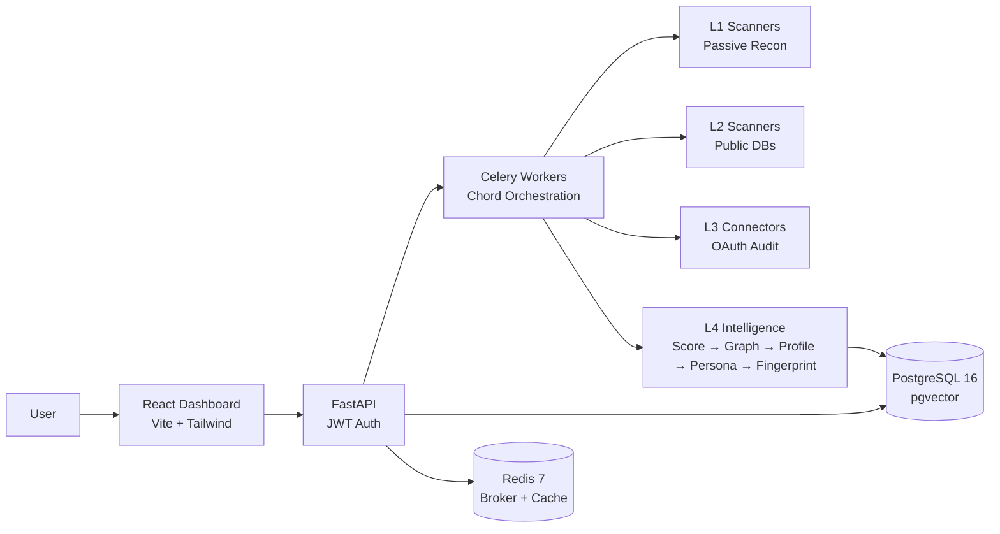

```
                                 ___
 __ __  _ __    ___   ___  ___  |__ \
 \ \/ /| '_ \  / _ \ / __|/ _ \    ) |
  >  < | |_) || (_) |\__ \  __/   / /
 /_/\_\| .__/  \___/ |___/\___|  |_|
       |_|    identity threat intelligence
```

[](https://python.org)
[](https://react.dev)
[](https://docker.com)
[](LICENSE)
[](#features)
[](#features)
[](#roadmap)

**Enter an email. See what the internet knows. Fix it.**

xpose is an identity threat intelligence platform that bridges deep OSINT tools (SpiderFoot, Maltego) with consumer-grade UX (Aura, NordProtect). Every finding is an Identity IOC — with actionable remediation.

---

## Features

| Layer | Category | Scanners | What it finds |
|:-----:|----------|----------|---------------|
| **L1** | Passive Recon | Holehe, Sherlock, HIBP, Gravatar, EmailRep, Epieos, FullContact, GitHub Deep, GHunt, Maigret, h8mail, Username Hunter | Account enumeration (120+ sites), breach history, social profiles, Google metadata, avatar matching |
| **L2** | Public Databases | DNS Deep, WHOIS, GeoIP, MaxMind, Leaked Domains | Domain security (SPF/DMARC/DKIM), IP geolocation, credential leaks, subdomain discovery |
| **L3** | Self-Audit | Google OAuth, Microsoft OAuth, Exodus Tracker, Browser Audit | Drive public files, Gmail forwarding rules, OAuth app permissions, app trackers |
| **L4** | Intelligence | Score Engine, Graph Builder, Profile Aggregator, Persona Engine, Fingerprint Engine, Confidence Propagator | Cross-reference all findings, dual score (exposure + threat), identity graph, PageRank confidence, digital fingerprint |

### Intelligence Engine (v0.26.0)

- **PageRank confidence propagation** — confidence flows through the identity graph (damping=0.85, convergence threshold 0.001)
- **Eigenvalue topology signature** — adjacency matrix eigenvalues via power iteration create unique graph fingerprints
- **Generative avatar** — deterministic SVG shape derived from graph eigenvalues + axes values
- **8-axis digital fingerprint** — accounts, platforms, username reuse, breaches, geo spread, data leaked, email age, security
- **Persona clustering** — groups digital personas by shared usernames, profile names, and avatars
- **Dual scoring** — exposure (0-100, weighted by category) + threat (0-100, weighted by breach recency)
- **Per-field confidence** — blacklist filtering + PageRank graph propagation + source reliability weighting

### Scraper Engine

51 data-driven scrapers across 8 categories, all editable via UI:

| Category | Count | Examples |
|----------|-------|---------|
| Social | 24 | Reddit, GitHub, Steam, Medium, Mastodon, StackOverflow, Twitch, Telegram |
| Breach | 3 | XposedOrNot, LeakCheck, Pastebin Dumps |
| Metadata | 4 | Gravatar, crt.sh, SecurityTrails, Disposable Email |
| People Search | 3 | GitHub People Search, Gravatar Email Lookup, Snapchat Profile |
| Identity | 3 | Genderize (gender), Agify (age), Nationalize (nationality) |
| Archive | 3 | Wayback Domain History, Wayback Snapshots, Wayback Profile Archive |
| Gaming | 9 | Steam, Xbox, PSN, Epic, Riot, Chess.com, Lichess, CodeWars, RuneScape |
| Music | 2 | Mixcloud, Duolingo |

## Architecture



## Quick Start

```bash
git clone https://github.com/nabz0r/xposeTIP.git && cd xposeTIP
cp .env.example .env                          # configure API keys
docker compose up -d                          # start all 5 services
docker compose exec api python scripts/seed_modules.py
docker compose exec api python scripts/seed_scrapers.py
# Register at http://localhost:5173 → Add target → Scan
```

First registered user = **superadmin** + **Enterprise** plan. Subsequent users = **Free** plan.

## Plans

| Plan | Price | Targets | Scans/mo | Layers | Key Features |
|------|-------|---------|----------|--------|-------------|
| Free | €0 | 1 | 5 | L1 | Basic exposure scan |
| Consultant | €49/mo | 25 | 100 | L1+L2 | Persona clustering, multi-workspace, PDF reports |
| Enterprise | €199/mo | Unlimited | Unlimited | All | Intelligence pipeline, API access, custom modules |

## Roadmap

| Version | Sprint | Status |
|---------|--------|--------|
| v0.1.0 | Docker, Auth, Holehe, Celery, React dashboard | Done |
| v0.2.0 | HIBP, Sherlock, Score engine, Identity graph | Done |
| v0.3.0 | Gravatar, Social Enricher, GeoIP, Settings UI | Done |
| v0.4.0 | Dynamic API keys (Fernet), Location mapping | Done |
| v0.5.0 | 7 new scanners, Profile aggregation, SVG world map | Done |
| v0.6.0 | Source scoring, Premium scanners, SaaS connectors | Done |
| v0.7.0 | Intelligence engine, Google OAuth audit, Demo flow | Done |
| v0.8.0 | Digital fingerprint, 8-axis radar, evolution timeline | Done |
| v0.9.0 | Scraper engine, modular scrapers with editable regex | Done |
| v0.10.0 | Quality polish, dedup, profile name fix | Done |
| v0.11.0 | 15 new scrapers: identity, archive, social expansion | Done |
| v0.12.0 | IdentityCard, photo strip, profile aggregator fix | Done |
| v0.13.0 | Persona clustering, per-field confidence, PersonaCard | Done |
| v0.14.0 | Dual score (exposure + threat), score history, LifeTimeline | Done |
| v0.15.0 | Real-time log viewer, Redis ring buffer, structured logging | Done |
| v0.16.0 | Multi-workspace, workspace CRUD, member invites, Organization | Done |
| v0.17.0 | Connected accounts, Google/Microsoft OAuth audit | Done |
| v0.18.0 | 7 gaming scrapers, 6 social scrapers, import/export (43 total) | Done |
| v0.19.0 | Scraper UI: test runner, toggle, YAML export/import | Done |
| v0.20.0 | Plans (Free/Consultant/Enterprise), open registration, billing UI | Done |
| v0.21.0 | Admin panel, quick scan, invite flow fix | Done |
| v0.22.0 | Documentation update | Done |
| v0.23.0 | Name blacklist, targets rework, scan metadata | Done |
| v0.24.0 | DNS SaaS blocklist, executive summary, CSV export | Done |
| v0.25.0 | 8 new scrapers: people search, gaming, social (51 total) | Done |
| v0.26.0 | PageRank confidence, eigenvalue fingerprint, generative avatar | Done |
| **v0.27.0** | **Landing page redesign, demo script, documentation** | **Done** |

> **Nexus 2026 — June 10-11, Luxembourg** &nbsp; Target: Grand Prize (€100K)

## Tech Stack

`FastAPI` `SQLAlchemy 2.0` `Celery` `PostgreSQL 16` `Redis 7` `React 18` `Vite` `Tailwind CSS 4` `D3.js` `Recharts` `Docker Compose` `Fernet AES-256` `JWT` `OAuth 2.0` `RBAC` `Genderize` `Agify` `Nationalize` `Wayback Machine CDX`

## Global Scope

xpose works worldwide with varying depth:
- **US targets**: Maximum data. Voter rolls, court records, Spokeo, WhitePages, BeenVerified — all public.
- **EU targets**: GDPR applies but we reveal exposure that already exists publicly.
- **Rest of world**: Varies. Module system adapts per region.

## License

MIT License. See [LICENSE](LICENSE).

---

<p align="center">
Built in Luxembourg &nbsp;|&nbsp; GDPR compliant &nbsp;|&nbsp; MIT License<br/>
<sub>Your personal SOC for privacy.</sub>
</p>
