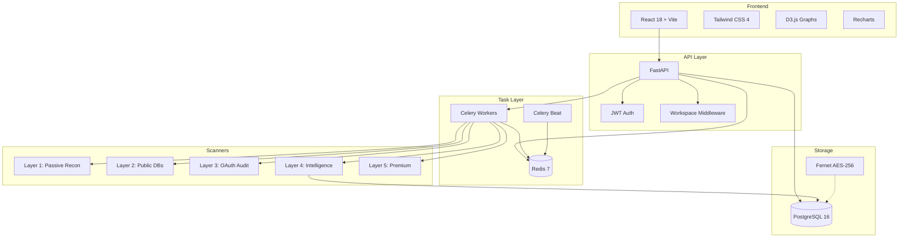
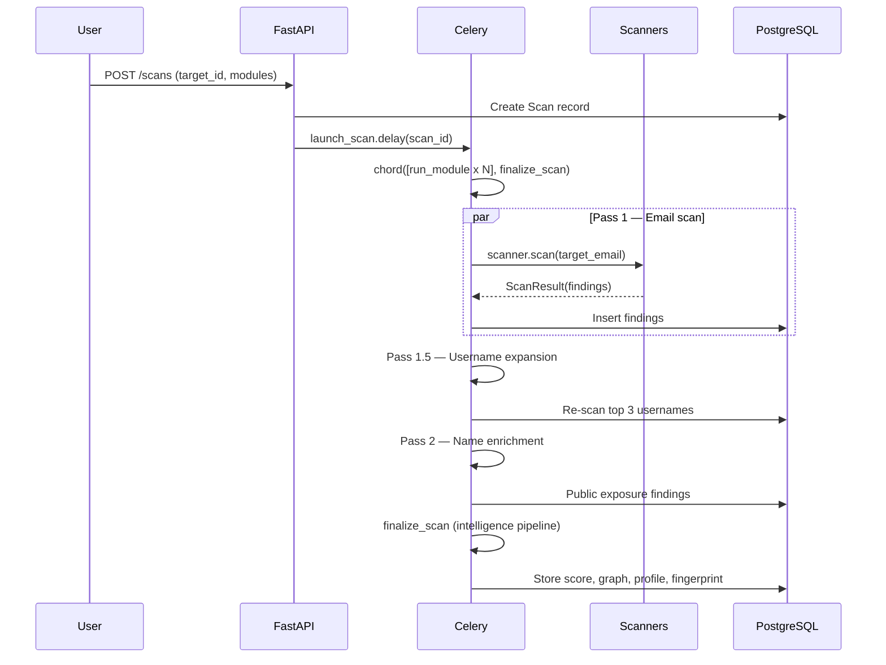
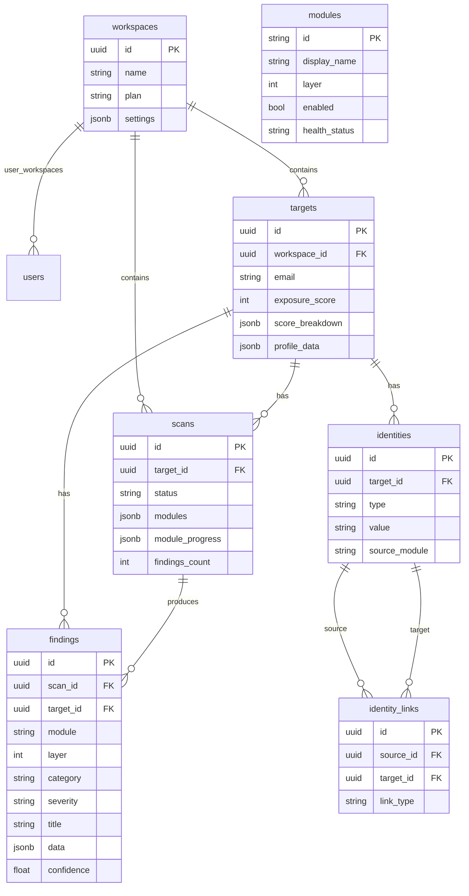

# Architecture — xposeTIP v1.1.0

## Design Philosophy

### Ethical OSINT
xpose reveals exposure to protect, not to exploit. Every finding includes its source
and a remediation action. No black-box scoring. No unconsented scanning.

### Green Intelligence (Amiga 500 Principle)
In 1987, demoscene coders created art with 512KB of RAM that still inspires today.
xpose follows this philosophy: maximum intelligence with minimum resources.

124 scrapers, PageRank, Markov chains, behavioral profiling, a rules engine — all on a
single machine. No GPU clusters. No distributed databases. No managed cloud services
required. 5 Docker containers. ~50 watts.

Every architectural decision asks: **"is this the lightest way to achieve this?"**

- Scrapers are data-driven JSON configs, not code-per-source
- PostgreSQL single node handles raw + gold + graph
- Celery + Redis for task orchestration, not Kafka
- Pixel art avatars: 5.4B unique combinations, zero API calls, zero GPU

### Education First
Every scan is a lesson. Findings explain the risk in plain language. Remediation actions
are specific and actionable. The goal is to make users informed enough to not need xpose.

## System Overview

## Two-Phase Scan Pipeline (Sprint 86)

All findings are gathered BEFORE graph/score/profile computation.

### Phase A — GATHER

| Step | Name | What it does |
|------|------|-------------|
| 1 | Email scan | Run all enabled scanner modules against email address |
| A1 | Cross-verify | Boost confidence on findings confirmed by multiple sources |
| A2 | Pass 1.5 — Username expansion | Select top 3 usernames, re-scan across username-capable scrapers |
| A3 | Early profile | Bootstrap primary_name (no graph_context) for Pass 2 |
| A4 | Pass 2 — Name enrichment | Use discovered real name for public exposure scrapers (GDELT, GNews, OpenSanctions) |

### Phase B — COMPUTE (all findings now in DB)

| Step | Name | What it does |
|------|------|-------------|
| B1 | Graph build | Build identity graph from ALL findings (Pass 1 + 1.5 + 2) |
| B2 | PageRank | Propagate confidence through graph (damping=0.85, 20 iter) |
| B3 | graph_context | Build unified context (node_scores, node_map, transition_matrix, clusters) |
| B4 | Score | Compute exposure + threat (ratio-based thresholds) |
| B5 | Profile | Final aggregation with graph_context (overwrites A3) |
| B6-B8 | Cleanup | Bio rejection, name validation, quick teaser |
| B9 | Identity enrichment | Re-query gender/age/nationality with discovered name (429 retry) |
| B10-B12 | Intelligence | Personas → 7 analyzers → fingerprint → SSE |

### Deep Scan

| | |
|------|-------------|
| Deep | Operator-triggered: scan any indicator type across all matching scrapers (cascade depth=1, max=5) |

## Intelligence Pipeline (finalize_scan order)

1. Cross-verify findings (boosts confidence)
2. Build identity graph (nodes + weighted edges)
3. PageRank confidence propagation (20 iterations, damping=0.85)
4. Build graph_context (node_scores, node_map, transition_matrix, clusters)
5. Compute score (exposure + threat, weighted by graph confidence)
6. Aggregate profile (names, avatar, bio — ranked by graph + source reliability)
7. Force bio cleanup (reject Telegram slogans, platform descriptions)
8. Force display_name blacklist validation
9. Identity enrichment (re-query Genderize/Agify/Nationalize with discovered name)
10. Cluster personas (graph-based with SequenceMatcher fallback)
11. Intelligence pipeline (7 analyzers: risk, breach, domain, behavioral, network, code_leak, behavioral_profiler)
12. Compute fingerprint (9-axis radar, eigenvalues, avatar_seed, timeline_events)
13. Store life_timeline in profile_data

## Code Leak Detection

GitHub Code Search API (free, 5 req/min) searches ALL public repositories for email
and username mentions. Finds leaked credentials, .env files, config files, API keys.
CodeLeakAnalyzer classifies findings by sensitivity (10 regex patterns for keys, tokens,
passwords, database URLs).

## Behavioral Profiling

BehavioralProfiler analyzer classifies identities into archetypes based on cross-platform
activity metrics: GitHub repos/followers, Reddit karma, Kaggle competitions, Medium followers.

5 archetypes: Developer (senior/active/present), Gamer, Creative/Designer, Social Influencer,
Privacy-conscious. Also detects account longevity and high-activity patterns.

## Deep Scan Pipeline (Sprint 82 + 84)

Operator-triggered deep scan on any indicator (username, email, domain, name).

Flow:
1. `POST /targets/{id}/scan-indicator` → Celery task `deep_indicator_scan`
2. `scan_single_indicator()` loads all scrapers matching input_type, executes against value
3. **Cascade** (depth=0 only): extract cross-type indicators from new findings
   - Username scraper finds email → chain email scrapers
   - Username scraper finds twitter_username → chain username scrapers
   - Username scraper finds blog/website → chain domain scrapers
   - Max 5 cascades, depth limit = 1 (no cascading cascades)
4. `_full_refinalize()` — 15-step pipeline mirror of finalize_scan:
   cross-verify → graph → PageRank → graph_context → score → profile →
   bio cleanup → name validation → quick teaser → identity enrichment →
   personas → intelligence → fingerprint → history → SSE

## Phase C — Web Discovery (operator-triggered)

Fingerprint-driven web reconnaissance. Explores the open web for leads
not covered by the 120 fixed scrapers.

Flow:
1. Operator clicks "Launch Discovery" in Discovered tab
2. Celery task `run_discovery` starts
3. Query Generator composes 15-20 search queries from known identifiers,
   behavioral fingerprint axes, geographic context, and username/name variants.
   Name queries disambiguated with corporate email domain (homonyme prevention).
4. SerpAPI executes queries, top results returned
5. Page Fetcher (trafilatura) downloads and extracts clean text from top 50 pages
6. 6 Extractors run on each page:
   rel=me (0.95), JSON-LD (0.95), Social links (0.85), Email (0.90), Meta tags (0.80), Username (0.60)
7. Quality gate filters leads (5 layers):
   nav/footer stripping, relevance scoring, LinkedIn penalty, geo penalty, page relevance check
8. Leads stored in `discovery_leads` with full discovery chain (JSONB)
9. Depth iteration: URL-type leads from depth 0 fetched at depth 1

Budget: 20 queries, 50 pages, 60 seconds default. Cost: ~$0.20/run (SerpAPI).
Data model: `discovery_sessions`, `discovery_leads`, `target_links`.

## Markov Chain / graph_context

Computed once after PageRank, passed to ALL downstream services:
- `node_scores`: {identity_id: confidence} — PageRank results
- `node_map`: {value: {type, confidence, platform, id}} — quick lookups
- `transition_matrix`: {node_id: {dest_id: probability}} — Markov transitions
- `clusters`: [{nodes, confidence, density, dominant_type}] — connected components

Services receive `graph_context=None` parameter. If present → enhanced behavior.
If absent → graceful fallback to pre-Markov behavior. Zero regression guarantee.

## Graph Edge Types

| Type | Meaning | Used for clustering? |
|------|---------|---------------------|
| registered_with | Email registered on platform | Yes |
| identified_as | Username identified as name | Yes |
| same_person | Email linked to username | Yes |
| exposed_in | Email exposed in breach | Yes |
| associated_with | Catch-all orphan link to email anchor | No (PageRank only) |
| located_in | Identity linked to location | No (PageRank only) |

Clustering BFS uses ONLY strong edges (first 4). Weak edges feed PageRank
but are excluded from persona clustering.

## Name Resolution

Composite score: `graph_confidence × 0.5 + source_reliability × 0.3 + source_count × 0.1`
Higher reliability sources (GitHub 0.85, LinkedIn 0.80) beat lower ones (scraper 0.60).
Names in the top PageRank cluster get a +0.15 boost.
Single-letter initials ("J.", "Steffen H.") are rejected.

## Username Validation

`is_valid_username()` in `username_validator.py` filters junk from the pipeline:
- Page titles (pipe `|`, en-dash, em-dash)
- HTML entities (`&#`, `&amp;`)
- Emoji-only strings, full names (2+ words with 3+ letters each)
- Known platform title patterns, domain handles (2+ dots)

Applied in both Pass 1.5 (username_expander) and profile aggregation (username list).

## Avatar Quality Ranking

`_score_avatar()` scores candidates 0-3:
- **3**: Real platform photos (githubusercontent, linktr.ee, pbs.twimg.com, googleusercontent)
- **2**: Unknown source (default)
- **1**: Generated/defaults (Gravatar identicons, Reddit defaults, protocol-relative URLs)
- **0**: Invalid/empty

Combined with source priority. Always synced to `target.avatar_url` on every aggregation.

## Email Age Inference

Extracts earliest timestamp from ALL findings:
- `BreachDate`, `created_at`, `joined`, `member_since`, `first_seen`, etc.
- Skips domain-level modules (dns_deep, whois_lookup)
- Caps by domain launch date (Gmail 2004, Outlook 2012, etc.)
- 30-year sanity cap

## Score Engine

Dual score: Exposure (how much is public) + Threat (how dangerous it is).
Each finding: `severity × confidence × source_reliability × graph_node_confidence`.
Graph weighting: `0.5 + node_conf × 0.5` (50% at zero confidence → 100% at full).

## Digital Fingerprint

9-axis radar: accounts, platforms, username_reuse, breaches, geo_spread,
data_leaked, email_age, security, public_exposure.
Eigenvalue computation from identity graph adjacency matrix.
Avatar seed: deterministic params for GenerativeAvatar.
Fingerprint hash: SHA256 of sorted axis values.

## GenerativeAvatar (32x32 Pixel Art)

CryptoPunk-style pixel face generated from `avatar_seed.email_hash`.
~5.4 billion combinations (face shape, skin, hair, eyes, mouth, accessories, clothing).
Score-reactive: expression changes, background shifts green→red, glitch pixels at high score.

## Scanner Modules: 35 total

| Layer | Modules |
|-------|---------|
| L1 (basic) | email_validator, holehe, hibp, sherlock, gravatar, social_enricher, google_profile, emailrep, epieos, fullcontact, github_deep, username_hunter |
| L2 (deep) | whois_lookup, maxmind_geo, geoip, leaked_domains, dns_deep |
| L3 (audit) | google_auditor, exodus_tracker, browser_auditor, databroker_check, paste_monitor |
| L4 (intel) | intelligence (5 analyzers), maigret, ghunt, h8mail |
| L5 (premium) | virustotal, shodan, intelx, hunter, dehashed, reverse_image, google_audit, microsoft_audit |

Seeded via `scripts/seed_modules.py`. Lazy-loaded via `importlib`.

## Scrapers: 117 total

Seeded via `scripts/seed_scrapers.py`. URL template + regex/JSONPath extraction.
Input transforms: `email_to_first_name`, `email_to_fullname` for name-based APIs.

## Database Schema

All datetime columns use `TIMESTAMP(timezone=True)`. DB: service=postgres, user=xpose.

## Multi-Tenant Design

Everything scoped to `workspace_id`:
- JWT tokens carry workspace_id in claims
- Middleware extracts workspace_id for every request
- All DB queries filter by workspace_id

### RBAC Roles
`superadmin` > `admin` > `consultant` > `client` > `user`

## Plan Enforcement

Three-tier plan system (Free/Consultant/Enterprise) enforced at API endpoints.
superadmin bypasses ALL limits. Plan lives on Workspace, not User.
Central config: `api/services/plan_config.py`.

## Pre-flush Truncation

Safety net in `module_tasks.py` before `session.flush()`:
- `title`: max 255, `url`: max 1024, `indicator_value`: max 500, `module`: max 50

## Encryption

API keys encrypted at rest using Fernet (AES-256-CBC + HMAC-SHA256).
Key derived from `SECRET_KEY`. Decrypted only at scan time.
