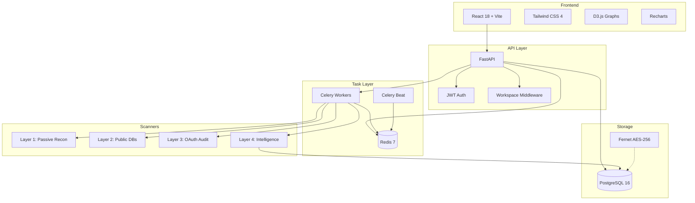
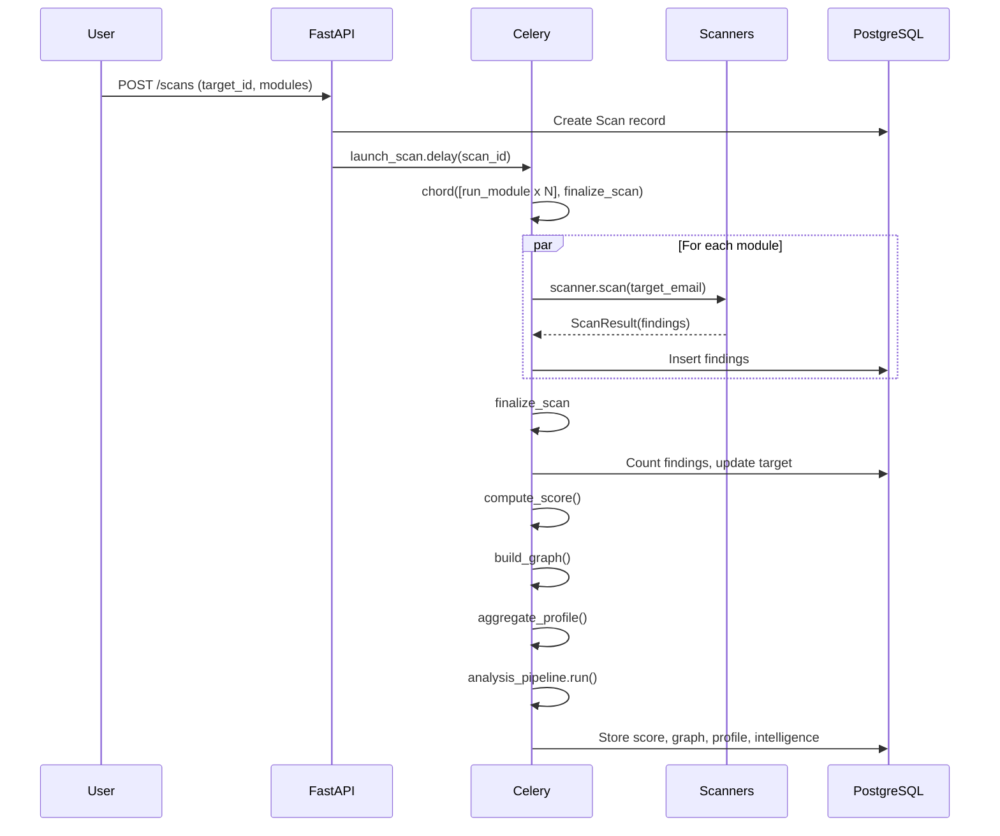
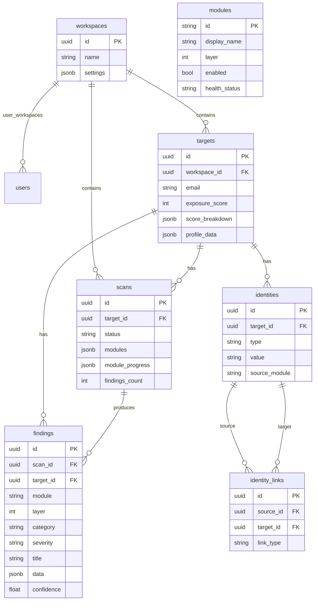

# Architecture

## System Overview



## Scan Pipeline



## Database Schema



## Multi-Tenant Design

Everything is scoped to a `workspace_id`:
- JWT tokens carry workspace_id in claims
- Middleware extracts workspace_id for every request
- All DB queries filter by workspace_id
- PostgreSQL Row-Level Security (RLS) planned for Phase 2

### RBAC Roles
`superadmin` > `admin` > `consultant` > `client` > `user`

Phase 1 uses superadmin only. Others activate in later phases.

## Score Engine

```
Exposure Score = Σ (category_weight × min(Σ severity_multiplier, 100))

Weights: breach=0.25, social=0.20, tracking=0.15, geo=0.12,
         data_broker=0.10, metadata=0.08, domain=0.05, paste=0.05

Severity: critical=5, high=4, medium=3, low=2, info=1
```

## Intelligence Pipeline

Runs automatically after each scan in `finalize_scan`:

1. **IP Analyzer** — ASN lookup, reverse DNS, infrastructure mapping
2. **Domain Analyzer** — Subdomain discovery (crt.sh), security headers, SSL check
3. **Username Correlator** — Cross-platform username reuse detection
4. **Breach Correlator** — Password reuse risk, exposure timeline
5. **Risk Assessor** — Overall risk level + prioritized remediation actions

Intelligence findings are stored as `layer=4, module="intelligence"`.

## Encryption

- API keys encrypted at rest using **Fernet** (AES-256-CBC + HMAC-SHA256)
- Encryption key derived from `SECRET_KEY`
- Stored in workspace `settings` JSONB column
- Decrypted only when passed to scanner at scan time
